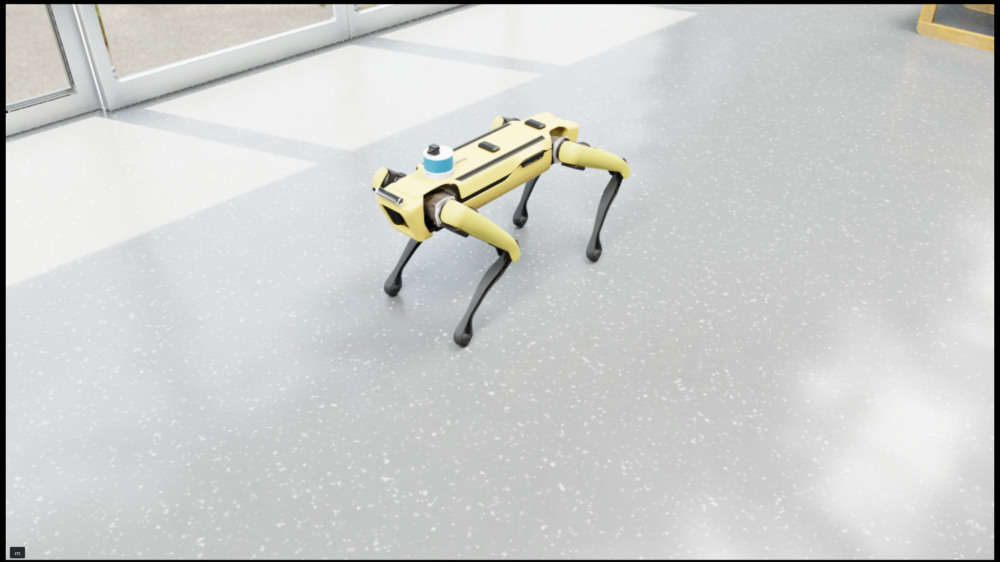
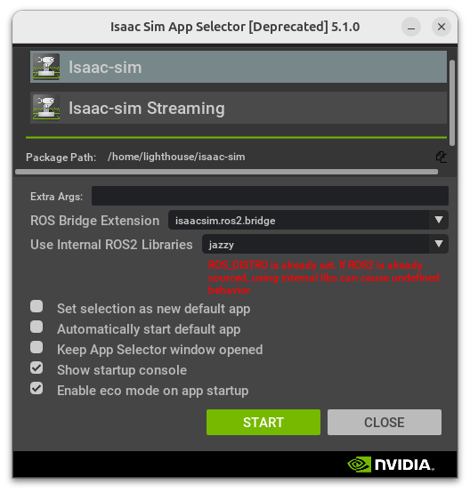
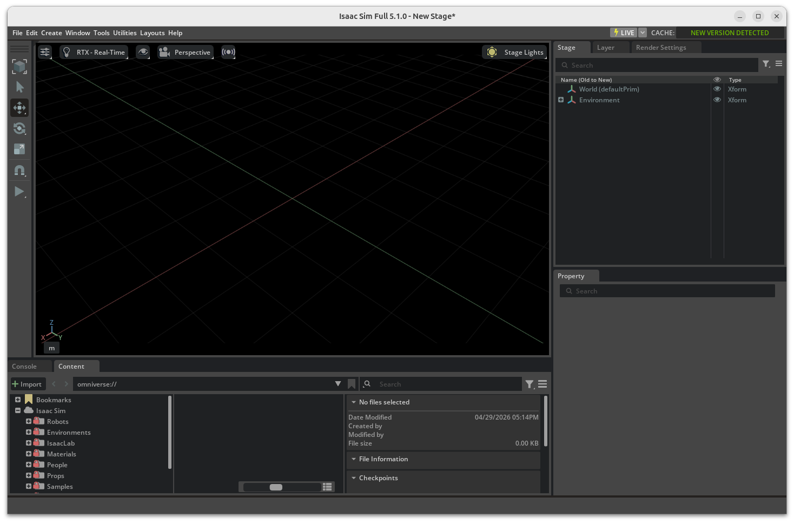
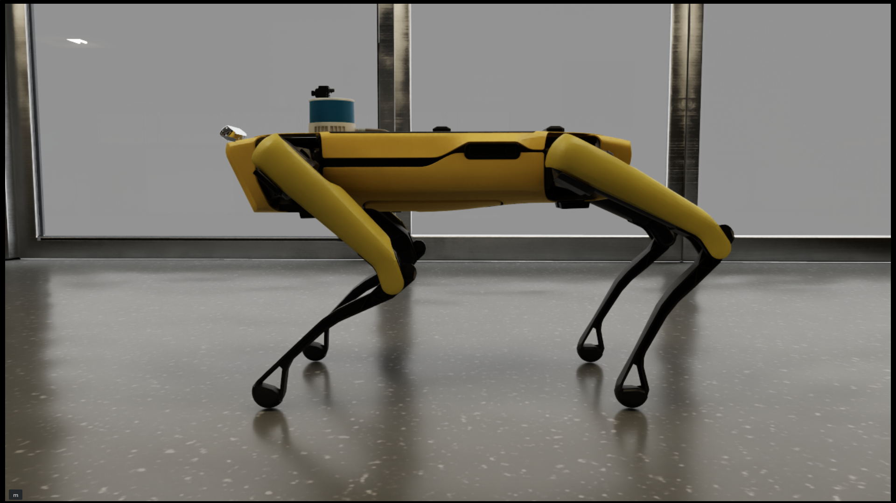

# Optimization In Progress

# spot-isaac-lab-hospital

Boston Dynamics **Spot** simulated in NVIDIA **Isaac Sim 5.1.0** inside a
custom hospital environment, with a full **ROS 2 Jazzy** interface for
navigation, perception and control.

The package ships:

- a custom hospital USD world with extra lighting added (see [`docs/MODIFY_WORLD.md`](docs/MODIFY_WORLD.md))
- a Spot robot with the sensors needed for ROS 2 navigation already attached in the initial stage
- a standalone Isaac Sim driver script that boots the scene, runs the locomotion policy and bridges sensors / `cmd_vel` to ROS 2

The robot is driven by Isaac Sim's `SpotFlatTerrainPolicy` (RL locomotion
policy) and accepts `/cmd_vel` (Twist or TwistStamped) from any ROS 2
controller — Nav2, `teleop_twist_keyboard`, custom planners, etc.



## Why Isaac Sim instead of Gazebo?

Gazebo is easy to set up but its physics is approximate. Isaac Sim provides
photorealistic rendering and an accurate physics world, at the cost of
needing a more powerful machine (GPU required) and a smaller community
making troubleshooting harder. This repo aims to lower that barrier by
shipping a working hospital + Spot setup out of the box.

---

## Prerequisites

- **Ubuntu 24.04 LTS**
- **NVIDIA GPU** with a recent driver (RTX series recommended)
- **Isaac Sim 5.1.0** — workstation install recommended
  <https://docs.isaacsim.omniverse.nvidia.com/5.1.0/installation/index.html>
- **ROS 2 Jazzy**
  <https://docs.ros.org/en/jazzy/Installation/Ubuntu-Install-Debs.html>
- ROS 2 dependencies:
  ```bash
  sudo apt install ros-jazzy-nav2-bringup ros-jazzy-robot-state-publisher
  ```

After installing Isaac Sim, verify it from the App Selector. From the Isaac
Sim install directory:

```bash
./isaac-sim.selector.sh
```



Pressing **START** should bring up an empty Isaac Sim stage:



---

## Setup

```bash
# 1. Clone
git clone https://github.com/SJoyTheHawk/spot-isaac-lab-hospital.git
cd spot-isaac-lab-hospital

# 2. Configure for your machine
cp env/spot_isaac.env.template env/spot_isaac.env
$EDITOR env/spot_isaac.env       # set ISAAC_SIM_PATH if not ~/isaac-sim

# 3. Build the ROS 2 workspace
source /opt/ros/jazzy/setup.bash
cd ros2_ws
colcon build
source install/setup.bash
cd ..
```

The hospital USD path is resolved by `scripts/run_isaac.sh` in this order:

1. `HOSPITAL_USD` env var (set in `env/spot_isaac.env`)
2. `assets/isaac_hospital_scene_spot.usd` inside the repo (default)

So a fresh clone runs without editing any absolute path.

---

## Operation

### Terminal 1 — Isaac Sim + sensor publishers

```bash
./scripts/run_isaac.sh
```

Wait ~1 minute for assets to load. Use the scroll wheel to zoom into the
world to see the Spot robot.



### Terminal 2 — `robot_state_publisher` (URDF → TF) *(optional)*

```bash
source /opt/ros/jazzy/setup.bash
source ros2_ws/install/setup.bash
ros2 launch spot_hospital_bringup robot_state_publisher.launch.py
```

This publishes the dynamic leg-link TFs (`body → fl_hip → fl_uleg → ...`)
from the `/joint_states` topic emitted by Isaac.

### Terminal 3 — drive the robot

Teleop (keyboard):

```bash
source /opt/ros/jazzy/setup.bash
ros2 run teleop_twist_keyboard teleop_twist_keyboard \
    --ros-args -r /cmd_vel:=/cmd_vel_unstamped \
    -p stamped:=true
```

Or send a one-shot command:

```bash
ros2 topic pub --once /cmd_vel geometry_msgs/msg/TwistStamped \
    "{header: {frame_id: base_link}, twist: {linear: {x: 0.5}}}"
```

---

## ROS 2 Topics

Once `run_isaac.sh` is running, you can see the ROS2 topics and tf tree:

| Direction | Topic                          | Type                              |
| --------- | ------------------------------ | --------------------------------- |
| pub       | `/clock`                       | `rosgraph_msgs/Clock`             |
| pub       | `/odom`                        | `nav_msgs/Odometry`               |
| pub       | `/imu/data`                    | `sensor_msgs/Imu`                 |
| pub       | `/point_cloud`                 | `sensor_msgs/PointCloud2`         |
| pub       | `/front_camera/image`          | `sensor_msgs/Image`               |
| pub       | `/{left,right,back}_fisheye/image` | `sensor_msgs/Image`           |
| pub       | `/realsense/camera`            | `sensor_msgs/Image`               |
| pub       | `/realsense/depth/points`      | `sensor_msgs/PointCloud2`         |
| pub       | `/isaac_joint_states`          | `sensor_msgs/JointState` (raw)    |
| pub       | `/joint_states`                | `sensor_msgs/JointState` (URDF)   |
| pub       | `/tf`, `/tf_static`            | `tf2_msgs/TFMessage`              |
| sub       | `/cmd_vel`                     | `geometry_msgs/TwistStamped`      |

### TF tree


---

## Sensors on Spot

The robot in `assets/isaac_hospital_scene_spot.usd` ships with a 3D LiDAR,
top RGB camera, IMU, odometry, RealSense D455i (toggleable) and three extra
fisheye RGB cameras (toggleable).

Mount poses are body-relative — `((x, y, z), (roll, pitch, yaw))` from the
`body` prim:

| Sensor          | Translation (m)         | RPY (rad)                                 |
| --------------- | ----------------------- | ----------------------------------------- |
| 3D LiDAR        | (0.223, 0.0, 0.1271)    | (0.0, 0.0, 0.0)                           |
| RealSense D455i | (0.45, 0.0, 0.07)       | (0.0, 0.872665, 0.0)  — 50° pitched down  |
| Top RGB camera  | (0.26, 0.0, 0.17)       | (0.0, 0.0, 0.0)                           |
| IMU             | (0.0, 0.0, 0.0)         | (0.0, 0.0, 0.0)                           |
| Left fisheye    | (-0.125, 0.12, 0.035)   | (0.0, 0.2, +π/2)                          |
| Right fisheye   | (-0.125, -0.12, 0.035)  | (0.0, 0.2, -π/2)                          |
| Back fisheye    | (-0.425, 0.0, 0.01)     | (0.0, 0.3, π)                             |

> The visual model and the virtual sensor pose can differ — you can run a
> sensor without a visible model, or have a model with no sensor.

### Modifying the world or sensor mounts

Open the USD in Isaac Sim:

```bash
./isaac-sim.selector.sh           # then File → Open
```

Pick `assets/isaac_hospital_scene_spot.usd` and save after editing. A short
walkthrough for editing sensor positions:
<https://www.youtube.com/watch?v=NV2hqw8wu3U>

The extra light setup is documented separately in
[`docs/MODIFY_WORLD.md`](docs/MODIFY_WORLD.md).

---

## Configuration

Most parameters are at the top of
[`isaac_sim/spot_standalone.py`](isaac_sim/spot_standalone.py):

| Variable                    | Type   | Purpose                                      |
| --------------------------- | ------ | -------------------------------------------- |
| `PHYSICS_NUM_THREADS`       | `int`  | PhysX worker threads. Keep ≥ 4; increase when enabling extra cameras |
| `CMD_SCALE`                 | `np.ndarray` | Maps `/cmd_vel` to RL policy command space |
| `CMD_VEL_STAMPED`           | `bool` | `True` for Nav2/ros2_control (TwistStamped)  |
| `ENABLE_FISHEYE_CAMERAS`    | `bool` | Add 3 body fisheye cameras (left/right/back). May slow simulation — increase `PHYSICS_NUM_THREADS` if needed |
| `ENABLE_REALSENSE`          | `bool` | Enable the RealSense D455 color/depth publishers. May slow simulation — increase `PHYSICS_NUM_THREADS` if needed |
| `ENABLE_LEG_TF`             | `bool` | Publish leg TFs from Isaac (off by default)  |
| `SENSOR_(SENSOR_NAME)_TRANS` / `_RPY` | `tuple` | TF mounts for laser, front cam, IMU, etc. |

For details about `scripts/run_isaac.sh` and `isaac_sim/spot_standalone.py`, see [`docs/RUN_SIMULATION.md`](docs/RUN_SIMULATION.md).


---

## Repository layout (pending to change)

```
.
├── isaac_sim/                  # Isaac Sim standalone Python scripts
│   ├── spot_standalone.py      # main driver — loads scene + builds OmniGraph
│   ├── list_graphs.py          # debug: dump all OmniGraph nodes
│   ├── rtx_lidar.py            # debug: RTX lidar prim helper
│   └── export_tf_pose.py       # debug: dump TF tree for sanity-checking
├── assets/                     # USD scenes + lighting docs
│   ├── isaac_hospital_scene_spot.usd
│   ├── scene_all.txt           # full prim dump
│   └── README.md               # lighting modification guide
├── ros2_ws/src/spot_hospital_bringup/
│   ├── urdf/spot.urdf          # Spot URDF (used by robot_state_publisher)
│   ├── maps/                   # Nav2 occupancy map (.yaml + .png)
│   └── launch/robot_state_publisher.launch.py
├── scripts/
│   ├── run_isaac.sh            # launch Isaac Sim with the standalone script
│   ├── run_ros2.sh             # launch robot_state_publisher
│   └── dump_scene_positions.py # dump prim poses to /tmp/scene_positions.txt
├── docs/photos/                # screenshots used in this README
└── env/
    └── spot_isaac.env.template # copy → spot_isaac.env, edit for your machine
```

---

## Nav2

The package ships an occupancy map at
`ros2_ws/src/spot_hospital_bringup/maps/spot_hospital_map.{yaml,png}`. Launch
a Nav2 stack against it with `use_sim_time:=true` and AMCL/SLAM consuming
`/point_cloud` (or via a `pointcloud_to_laserscan` adapter).

---

## Troubleshooting

**Jittery sensor timestamps** — the physics step is falling behind real time.
Reduce `PHYSICS_NUM_THREADS` only if you have < 8 cores; otherwise try
increasing `physics_dt` from `1/500` toward `1/200`.

**`IsaacComputeOdometry` shape error** — extra `RigidBodyAPI`s are nested
under `/World/spot/body/`. The script strips these automatically; if you see
the error, check that the USD reference resolved correctly.

**Conflicting TF emitters** — Isaac and `robot_state_publisher` both publish
leg TFs by default. Keep `ENABLE_LEG_TF = False` and let
`robot_state_publisher` own the URDF kinematic tree.

**"Authoring to instance proxy not allowed"** — when adding lights or other
prims, write them under `/World/hospital/Inhouse_Light/` (outside the
instanced hospital reference), not inside `/World`.

---

## License

Apache-2.0. The Spot URDF and Isaac Sim assets are subject to their
respective upstream licenses (NVIDIA Isaac Sim assets, Boston Dynamics Spot
description).

## Sponsor Me (With Thanks)

[](https://github.com/sponsors/SJoyTheHawk)