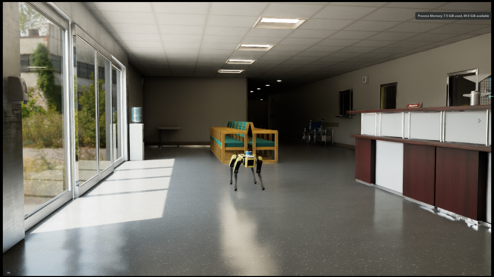
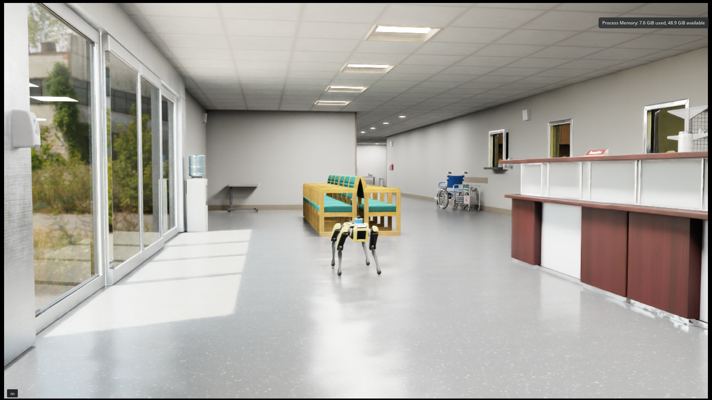
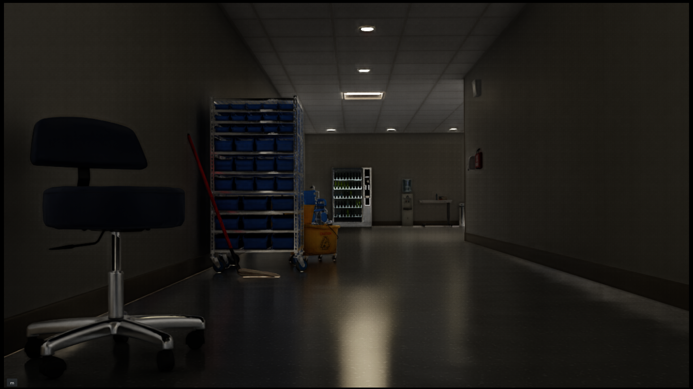
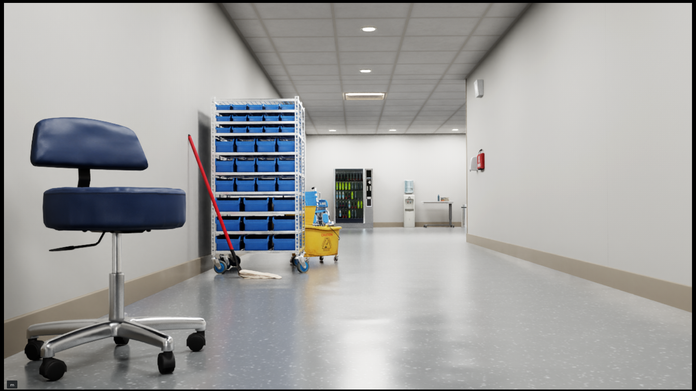
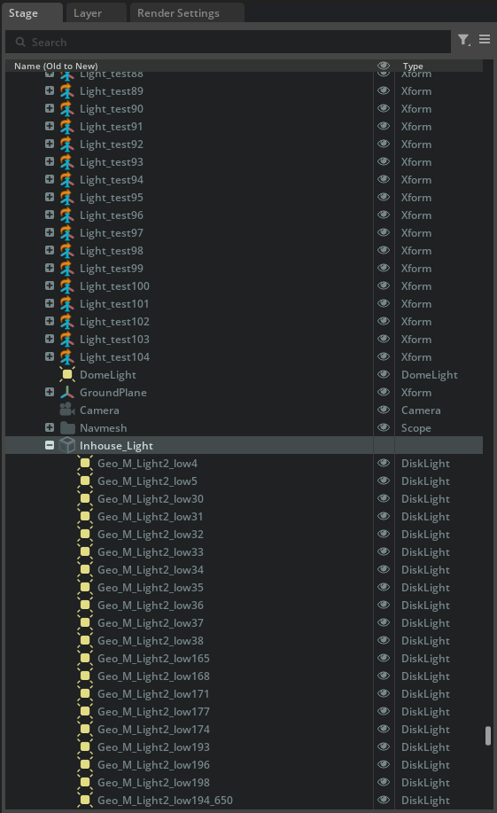
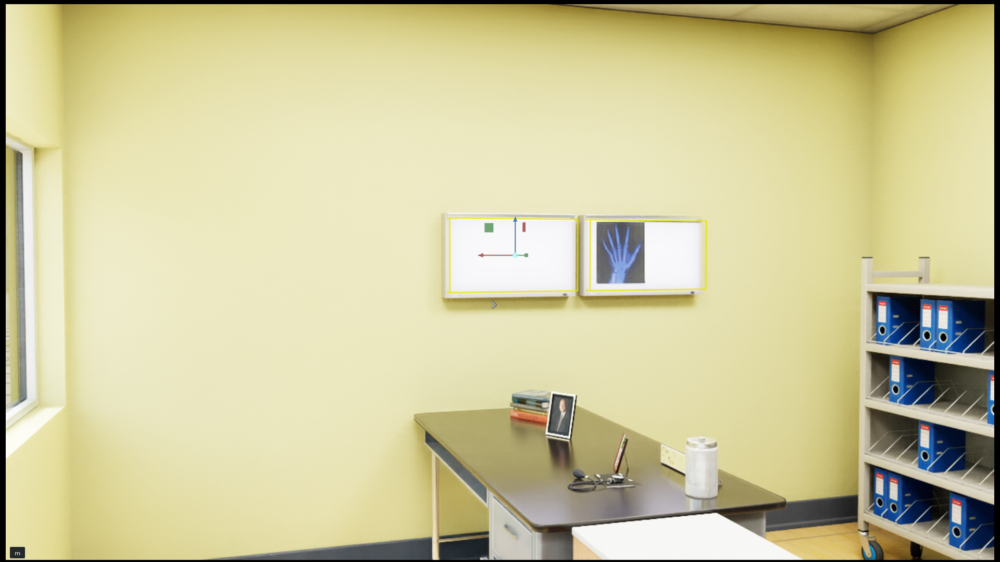
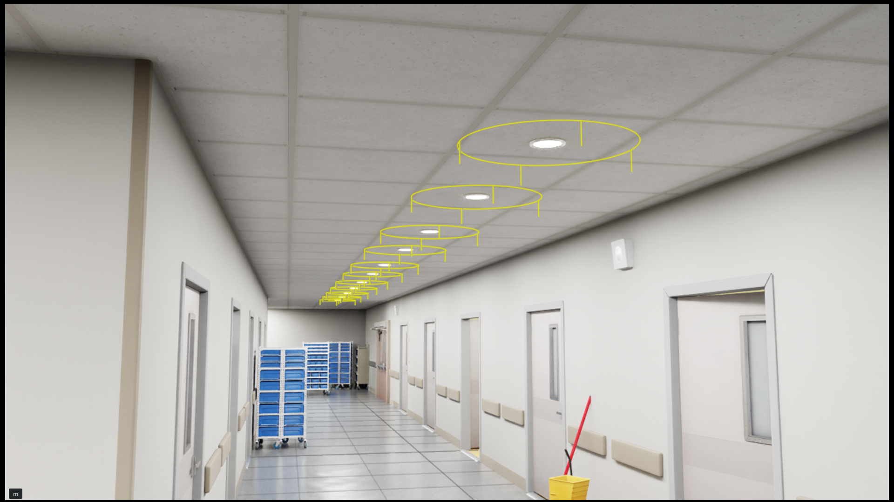
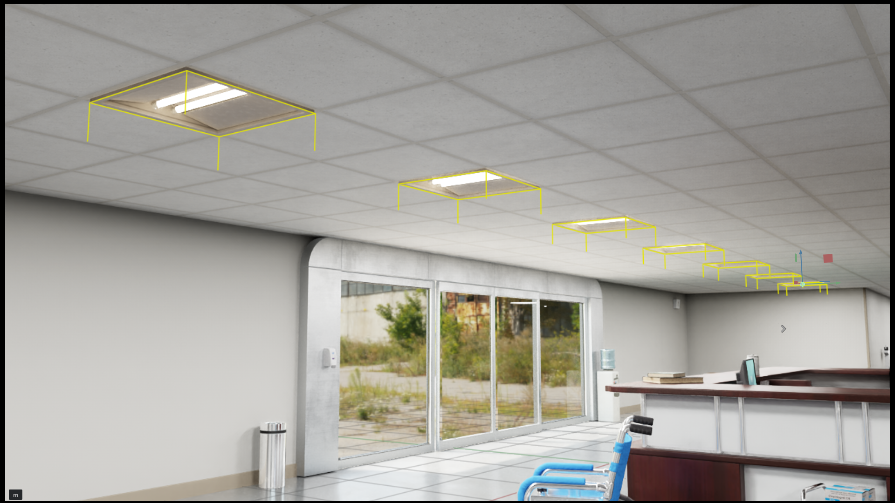

# Scene Lighting Modification

## Overview

The hospital USD scene (`isaac_hospital_scene_spot.usd`) ships with decorative light fixture models that carry **no actual light emission**. As a result the rendered scene is extremely dark, making camera capture and downstream analytics (object detection, navigation, etc.) unreliable.

### Overall scene

| Before | After |
|--------|-------|
|  |  |

### Camera view (Spot robot perspective)

| Before | After |
|--------|-------|
|  |  |

---

## Step 1 – Dump All Prim Positions

Run the position-dump script from the Isaac Sim root so that the correct Python environment is sourced:

```bash
cd spot-isaac-lab-hospital/scripts
./run_isaac.sh ./dump_scene_positions.py
```

> The script boots a headless `SimulationApp`, opens the stage, traverses every prim, and writes a table containing **element type, world position (x, y, z), quaternion orientation (qx, qy, qz, qw), RPY orientation (roll, pitch, yaw)** and the full **USD path** of every prim.

The default output path is `/tmp/scene_positions.txt`. Use `--out <file>` to override it.

A sample file is provided at `assets/scene_positions.txt`.  The table header looks like:

```
TYPE      X       Y       Z      QX    QY    QZ    QW   R_deg P_deg Y_deg  PATH
```

---

## Step 2 – Identify Light Fixture Models

Filter `scene_positions.txt` for the three categories of light fixtures present in the scene:

| # | Model type | Example USD path |
|---|-----------|-----------------|
| 1 | **X-ray light box** | `/World/hospital/SM_Xraylightbox_01a_117` |
| 2 | **Dome light** | `/World/hospital/Geo_M_Light2_low5` |
| 3 | **Rectangular fluorescent ceiling light** | `/World/hospital/Light_test4` |

The ceiling lights has different brightness setting by location:
- **Corridor** lights – (brighter, open hallway)
- **In-room** lights – (smaller, enclosed rooms)

---

## Step 3 – Add USD Lights

All new lights are placed under the group prim:

```
/World/hospital/Inhouse_Light/
```

Each light prim is named **identically** to its corresponding fixture model prim.



### 3.1 X-ray Light Box → `RectLight`

The `RectLight` is oriented so that it shines **back into** the light-box panel (reflective illumination) rather than outward into the room.

| Parameter | Value |
|-----------|-------|
| Color Temperature | 6500.0 K |
| Intensity | 1500.0 |
| Exposure | 0.0 |
| Height | 0.70 m |
| Width | 0.38 m |

Position: Slightly outward from lightbox's position, by 0.12m.



### 3.2 Dome Light → `DiskLight`

The dome-light model's reference point is at its **centre**, so the `DiskLight` is placed at the exact position reported in `scene_all.txt` with offset at z axis by -0.04m.

| Parameter | Value |
|-----------|-------|
| Color Temperature | 6500.0 K |
| Intensity | 30000.0 |
| Exposure | 0.0 |
| Radius | 0.5 m |



### 3.3 Fluorescent Ceiling Light → `RectLight`

The fluorescent tile models are **0.88 m × 0.88 m** and their reference/pivot point is at the **corner** of the model (not the centre). To place the `RectLight` at the true centre of the tile a fixed offset is applied:

```
light_x = model_x + (-0.44 m)   # half-width shift
light_y = model_y + (+0.44 m)   # half-height shift
light_z = model_z + (-0.004m)   # slightly downward
```

#### Corridor lights

| Parameter | Value |
|-----------|-------|
| Color Temperature | 6500.0 K |
| Intensity | 60000.0 |
| Exposure | 0.0 |
| Height | 0.88 m |
| Width | 0.88 m |

#### In-room lights

| Parameter | Value |
|-----------|-------|
| Color Temperature | 6500.0 K |
| Intensity | 25000.0 |
| Exposure | 0.0 |
| Height | 0.88 m |
| Width | 0.88 m |


